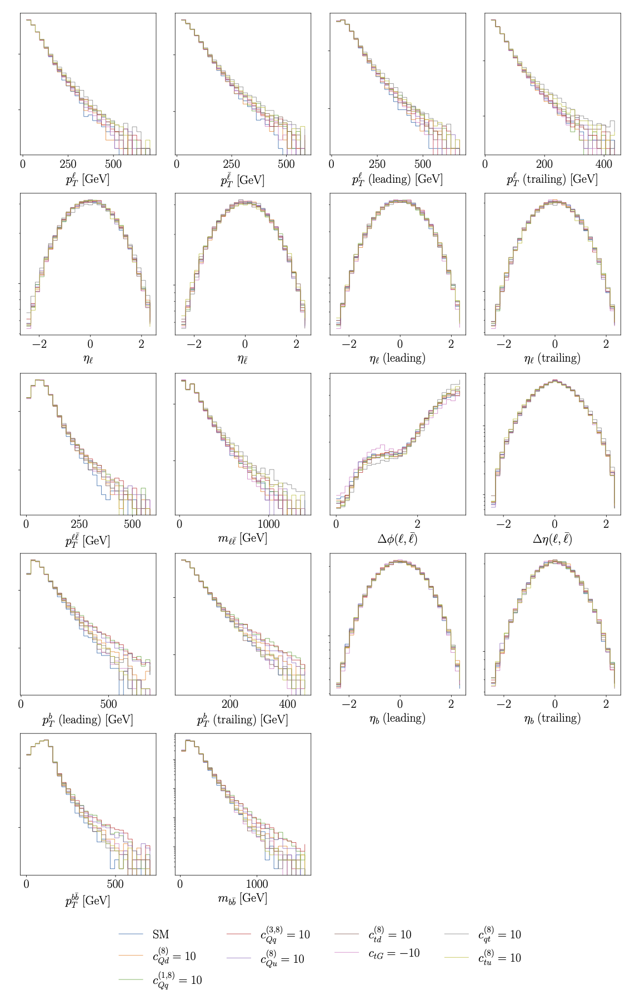

.. _kinematics:

Kinematic features used as inputs to the neural network
============================================================

In the case of top quark pair production in the dileptonic decay channel,

.. math::

        p p \rightarrow t \bar{t}, t \bar{t} \rightarrow b \bar{b} \ell^{+} \ell^{-} \nu_{\ell} \bar{\nu}_{\ell} \, ,

one has access to
a large set of final state kinematic features.  

We display here the kinematic features used as inputs to the neural network, 
calculated both in the SM and at representative points in the SMEFT parameter space.
Both linear and quadratic contributions from the SMEFT operators are included.

The kinematic features are defined as follows:

.. list-table:: Definitions of the kinematic features displayed in the figure above.
   :widths: 25 30
   :header-rows: 1

   * - Label
     - Definition
   * - :math:`p_T^{\ell}`
     - :math:`p_{T}` of the charged lepton
   * - :math:`p_T^{\bar{\ell}}`
     - :math:`p_{T}` of the charged antilepton
   * - :math:`p_T^{\ell}` (leading)
     - :math:`p_{T}` of the leading charged lepton
   * - :math:`p_T^{\bar{\ell}}` (trailing)
     - :math:`p_{T}` of the trailing charged lepton
   * - :math:`\eta_{\ell}`
     - Pseudorapidity of the charged lepton
   * - :math:`\eta_{\bar{\ell}}`
     -  Pseudorapidity of the charged antilepton
   * - :math:`\eta_{\ell}` (leading)
     -  Pseudorapidity of the leading charged lepton
   * - :math:`\eta_{\ell}` (trailing)
     -  Pseudorapidity of the trailing charged lepton
   * - :math:`p_{T}^{\ell \bar{\ell}}`
     - :math:`p_{T}` of the dilepton system
   * - :math:`m_{\ell \bar{\ell}}`
     - Invariant mass of the dilepton system
   * - :math:`\Delta \phi (\ell, \bar{\ell})`
     - Azimuthal angle between the two charged leptons
   * - :math:`\Delta \eta(\ell, \bar{\ell})`
     - Pseudorapidity between the two charged leptons
   * - :math:`p_T^{b}` (leading)
     - :math:`p_{T}` of the leading b quark
   * - :math:`p_T^{\bar{b}}` (trailing)
     - :math:`p_{T}` of the trailing b quark
   * - :math:`\eta_{b}` (leading)
     -  Pseudorapidity of the leading b quark
   * - :math:`\eta_{b}` (trailing)
     -  Pseudorapidity of the trailing b quark
   * - :math:`p_{T}^{b \bar{b}}`
     - :math:`p_{T}` of the :math:`b \bar{b}` system
   * - :math:`m_{b \bar{b}}`
     - Invariant mass of the :math:`b \bar{b}` system
