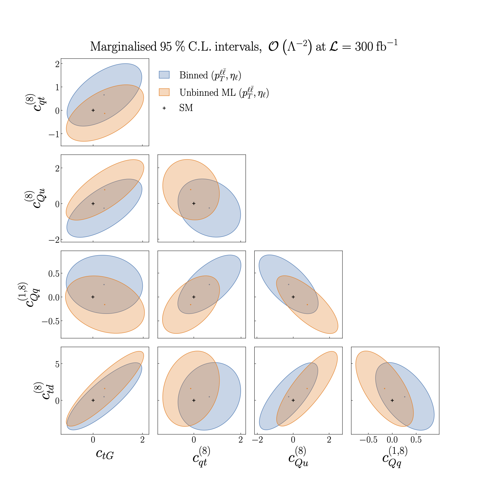

.. _particle2:

Results from the ML model vs binning in two features, :math:`O(\Lambda^{-2})`
=============================================================================
Figure 5.2 of :cite:`ML4EFT_temp_id`.

95% CL intervals on :math:`n_{eft}=5` Wilson coefficients relevant for the description of top quark pair
production at the linear :math:`O(\Lambda^{-2})` level.

The black cross indicates the SM values used to generate the pseudo-data.
We present marginalised intervals, obtained from the full posterior distribution
provided by Nested Sampling. 

We compare the constraints obtained from the ML model trained on two features, :math:`p_{\ell \ell}` and :math:`\eta_{\ell}`,
with those obtained from a binned analysis of the same features.

See also :ref:`the next page<particle3>`
for the comparison of this ML model with the ML model trained on the full set of :math:`n_{k} = 18`
kinematic features.

Note that we do not constrain the coefficients :math:`C_{Qd}^{(8)}`, :math:`C_{Qq}^{3,8}` or :math:`C_{tu}^{(8)}`
here, due to their approximate degeneracies with the coefficients :math:`C_{Qu}^{(8)}`, :math:`C_{Qq}^{1,8}` and :math:`C_{td}^{(8)}`
respectively at the linear order, :cite:`Brivio:2019ius`.
