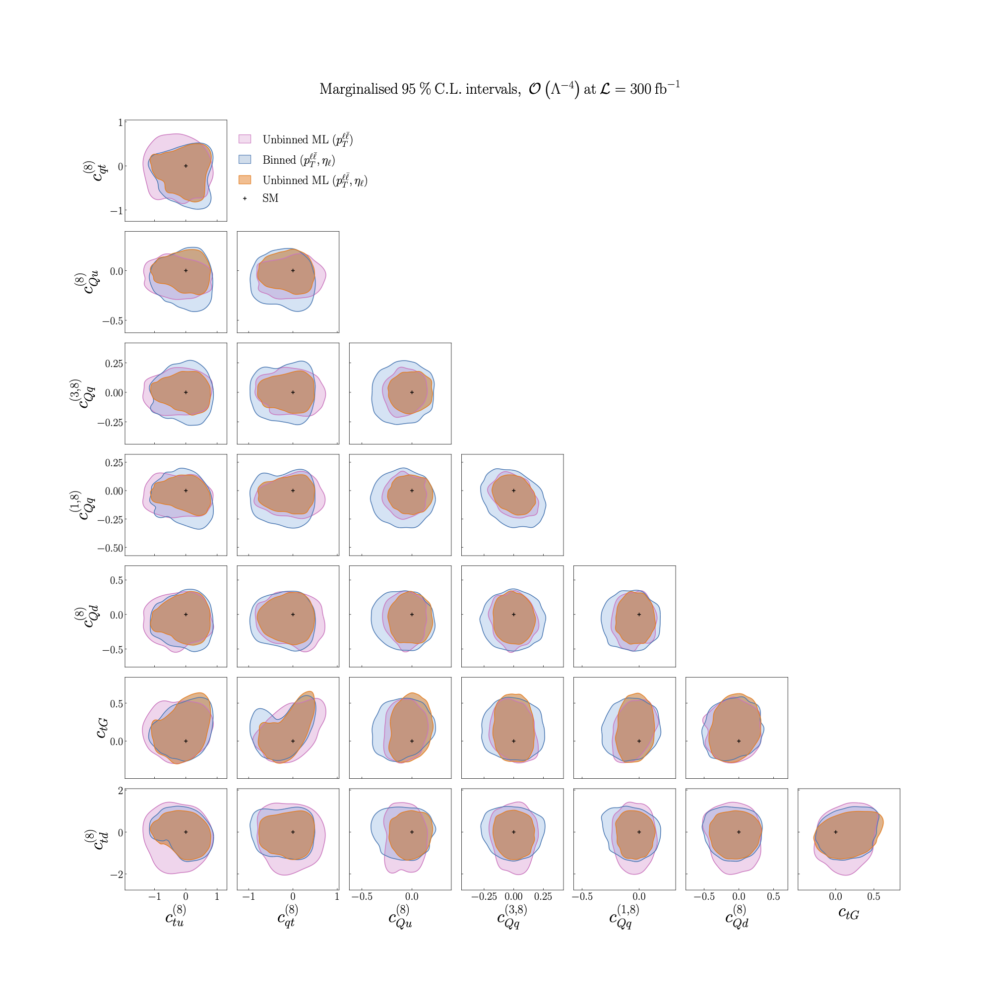

.. _particle4:

Results from the ML model vs binning in two features, :math:`O(\Lambda^{-4})`
==============================================================================
Figure 5.4 of :cite:`ML4EFT_temp_id`.

95% CL intervals for the :math:`n_{eft} = 8` Wilson coefficients relevant for the description of top quark pair
production at the quadratic :math:`O(\Lambda^{-4})` level. 

The black cross indicates the SM values used to generate the pseudo-data
that enters the inference. 
We present marginalised intervals, obtained from the full posterior distribution
provided by Nested Sampling.

We compare the constraints obtained from the ML model trained on one feature, :math:`p_{\ell \ell}`, and
on two features, :math:`p_{\ell \ell}` and :math:`\eta_{\ell}`,
with those obtained from a binned analysis of the same two features.

See also :ref:`the next page<particle5>` 
for the comparison of the ML model trained on two features 
with the ML model trained on the full set of :math:`n_{k} = 18`
kinematic features.

