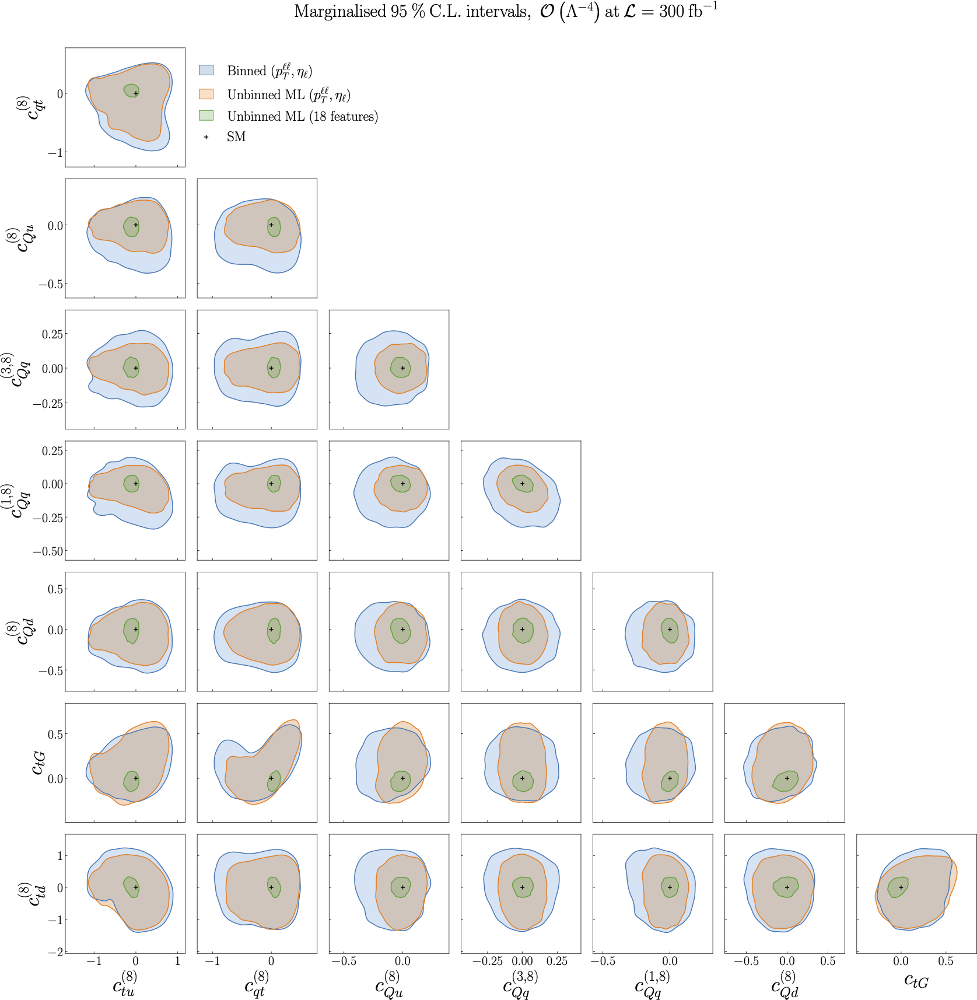

.. _particle5:

Results from the ML model training on two features vs all features, :math:`O(Λ^{-4})`
=====================================================================================
Figure 5.5 of :cite:`ML4EFT_temp_id`.

Following from :ref:`the previous results<particle4>`, we now present a comparison of the results obtained by
means of the ML model when only (:math:`p_{\ell \ell}`, :math:`\eta_{\ell}`) are used for the training vs when the full set of :math:`n_{k} = 18` kinematic features is
used.  We observe a marked improvement in the constraints obtained on each SMEFT operator when all kinematic features are used.  

These constraints are also compared to those obtained from a binned analysis of (:math:`p_{\ell \ell}`, :math:`\eta_{\ell}`), shown in blue, and 
again we see an improvement when using the ML model.

