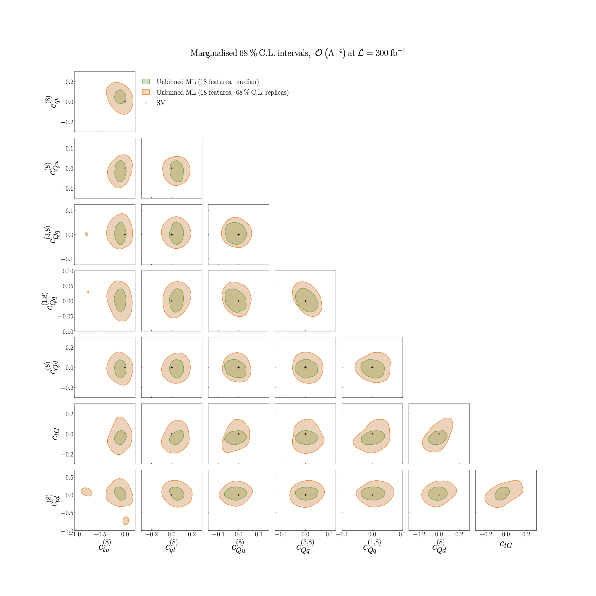

.. _particle6:

Impact of methodological uncertainties
======================================
Figure 5.9 of :cite:`ML4EFT_temp_id`.

Pair-wise 68% CL contours for the Wilson coefficients entering top quark pair production in the dilepton final state. 

We compare the bounds obtained by calculating the median across the :math:`N_{\rm rep}` 
MC replicas used in training with those obtained by taking into account the 
impact of the 1-:math:`\sigma` methodological uncertainties. 
Both ML models are trained on the full set of 18 kinematic features relevant for 
particle level top quark pair production in the dilepton final state.

By comparison with the corresponding bounds displayed on :ref:`the previous page<particle5>`, we confirm that these methodological 
uncertainties, as estimated with the replica method,
do not modify the qualitative results obtained from the median of the likelihood ratio. 
In particular, the observation that bounds obtained using multivariate unbinned observables are much stronger than those based on unbinned models based on one or two kinematic features
remains valid once replica uncertainties are accounted for. 

