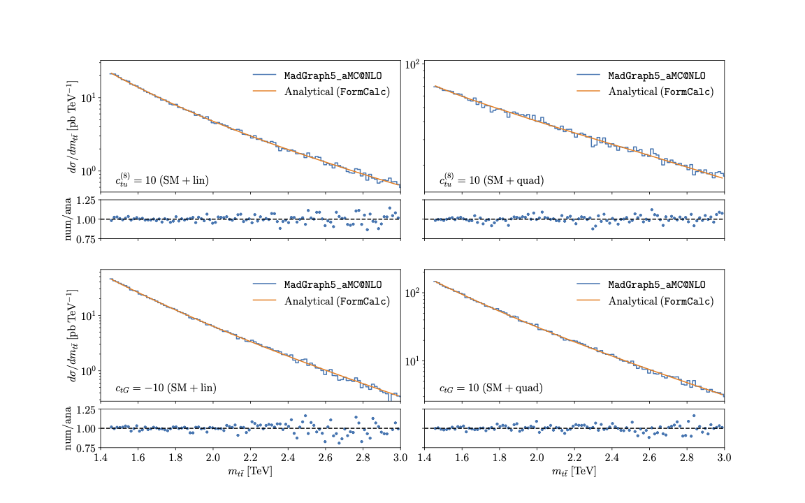

Pseudo-data generation and benchmarking
============================================================

Pseudo-data is generated using ``MadGraph5_aMC@NLO`` :cite:`Alwall:2014hca`
interfaced to ``SMEFTsim`` :cite:`Brivio:2017btx`, :cite:`Brivio:2020onw`
with ``NNPDF31_nnlo_as_0118`` as the input PDF set :cite:`Ball:2012cx`. 

Here we compare the distribution of pseudo-data in the parton level :math:`m_{t\bar{t}}` invariant mass to the FormCalc-based analytical calculation.
Technical details of the analytical calculation can be found in the code documentation: 
:doc:`ml4eft.core.truth <../_autosummary/ml4eft.core.truth>`

