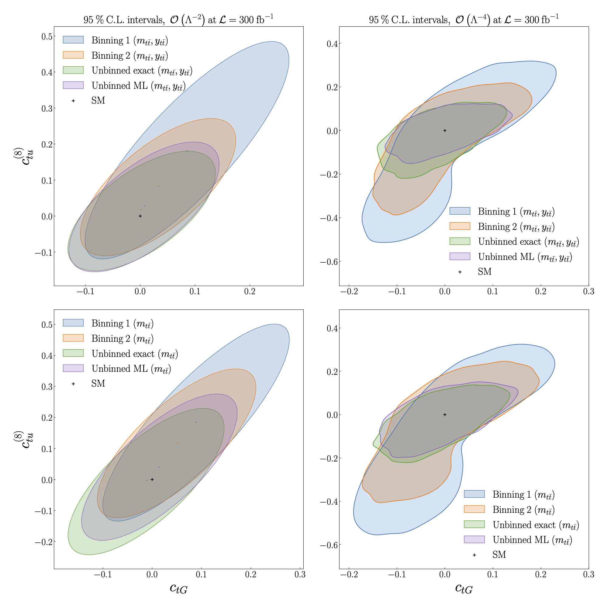

Constraints on the SMEFT
============================================================
We compare the constraints on :math:`C_{tu}^{(8)}` and :math:`C_{tG}` at 95% CL obtained from a binned analysis to those obtained from the unbinned ML model.

In the upper plots we make use of two features: the invariant mass :math:`m_{t \bar{t}}` and rapidity :math:`y_{t \bar{t}}` of the top quark pair.
In the lower plots we use a single feature, :math:`m_{t \bar{t}}`.

Two sets of binnings are used:

- Binning 1:

.. math::
   m_{t \bar{t}} \in [1.45, 2.5, \infty) \textrm{ TeV}, \\
   y_{t \bar{t}} \in \pm [0,1.5,3.0]

- Binning 2:

.. math::
   m_{t \bar{t}} \in [1.45, 1.5, 1.55, 1.6, 1.7, 1.8, 1.9, 2.0, 2.1,\\ 2.2, 2.3, 2.4, 2.5, 2.6, 2.7, 2.8, 2.9, 3.0, \infty) \textrm{ TeV}, \\
   y_{t \bar{t}} \in \pm [0, 0.3, 0.6, 0.9, 1.2, 3.0]

In the left plots, we obtain constraints by working to linear order :math:`O(\Lambda^{-2})` in the EFT calculation.
In the right plots we work to quadratic order :math:`O(\Lambda^{-4})`.

   

In general, we find an improvement in the
constraints obtained using the unbinned ML model compared to the binned analysis, as well as good agreement
between the ML model and exact calculation.
