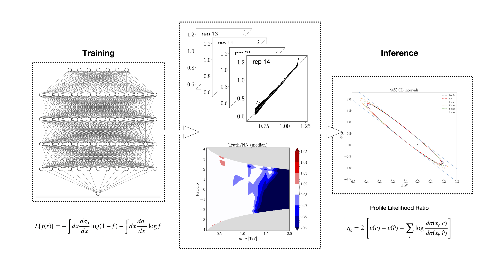

.. ML4EFT documentation master file, created by
   sphinx-quickstart on Tue Aug 16 09:50:44 2022.
   You can adapt this file completely to your liking, but it should at least
   contain the root `toctree` directive.

Welcome to ML4EFT's documentation!
==================================

    *Caption*

.. toctree::
   :maxdepth: 5
   :caption: Overview
   :hidden:

   overview/features.rst
   overview/quadratic_classifier.rst
   overview/mlspecs.rst

.. toctree::
   :maxdepth: 4
   :caption: Code
   :hidden:

   modules/installation.rst
   modules/quad_clas.rst
   modules/tutorial.rst

.. toctree::
   :maxdepth: 4
   :caption: Results
   :hidden:

   results/overview.rst

[to be rephrased & edited] Optimizing theoretical interpretations of particle physics data demands identifying experimental observables with high sensitivity to the model parameters of interest. In particular, quantifying the optimal sensitivity that can be attained within a given process is instrumental to inform global fits of Standard Model (SM) parameters, such as those of parton distribution functions, as well as those in beyond the SM scenarios, such as the Wilson coefficients of the Standard Model Effective Field Theory (SMEFT). 

With this motivation, here we develop a *general framework for the integration of unbinned observables in global fits of particle physics data,* (titled ML4EFT? quad_clas?) 

Machine learning regression and classification techniques are deployed to parameterise high-dimensional likelihoods with the Monte Carlo replica method to assess methodological uncertainties. 

See the :ref:`Overview<overview>` section for more details.

Publications & Results
----------------------------------
The ML4EFT code has been used in a recent study, Ref ..., in which, adopting the SMEFT as a proof-of-concept, we construct unbinned observables in top-quark pair and Higgs associated production at the LHC and demonstrate their impact once included in the SMEFiT global analysis of top, Higgs, and diboson data. 

Results from this are detailed in the :ref:`Results<results>` section, including animations not present in the paper.

The ML4EFT code is available in the :ref:`Code<code>` section.

Team Description
----------------------------------
- Raquel Gomez Ambrosio *Universita degli Studi di Milano-Bicocca and INFN*
- Maeve Madigan *University of Cambridge*
- Jaco ter Hoeve, *VU Amsterdam and Nikhef Theory Group*
- Juan Rojo, *VU Amsterdam and Nikhef Theory Group*
- Veronica Sanz *Universidad de Valencia-CSIC and University of Sussex*
  
Citation policy
----------------------------------
If you use the ML4EFT code in a scientific publication, please make sure to cite:

Indices and tables
==================

* :ref:`genindex`
* :ref:`modindex`
* :ref:`search`
