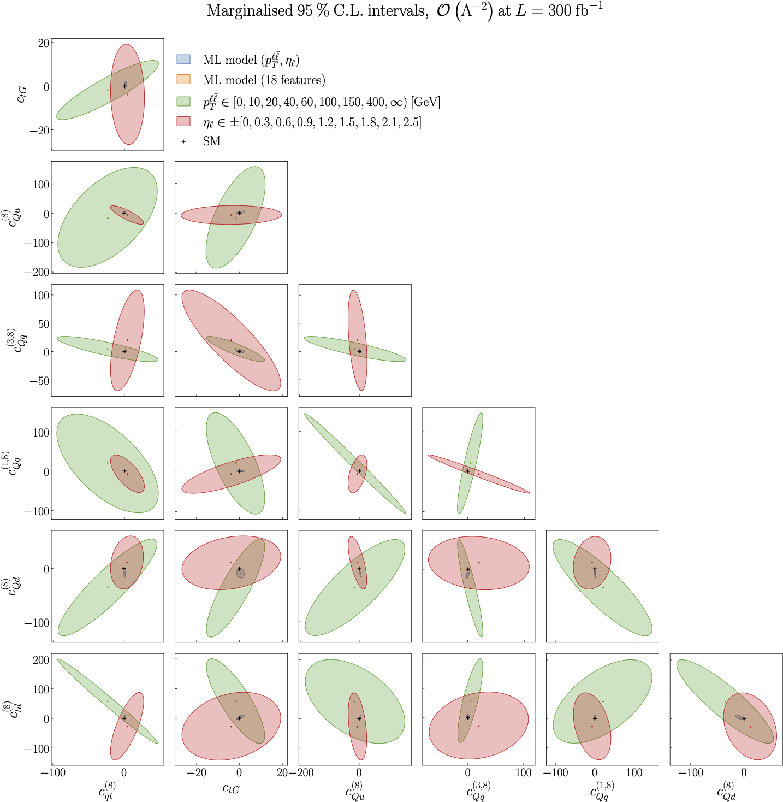

.. _particle2:

Results from the ML model vs binning in two features, :math:`O(\Lambda^{-2})`
==============================================================================
Figure 5.2 of :cite:`ML4EFT_temp_id`.

95% CL intervals for the :math:`n_{eft}=7` Wilson coefficients relevant for the description of top quark pair
production at the linear :math:`O(\Lambda^{-2})` level. The black cross indicates the SM values used to generate the pseudo-data
that enters the inference. 
We present pair-wise marginalised intervals, obtained from the full posterior distribution
provided by Nested Sampling. We compare the results obtained from two binned observables, one presented in terms
of :math:`p_{\ell \ell}` and the other in terms of :math:`\eta_{\ell}`, with that of the ML unbinned observable constructed with the two kinematic
features :math:`p_{\ell \ell}` and :math:`\eta_{\ell}`. 

See also :ref:`the next page<particle3>`     
for the comparison of the latter with the case in which the full set of :math:`n_{k} = 18`
kinematic features available are used to train the ML classifier.

