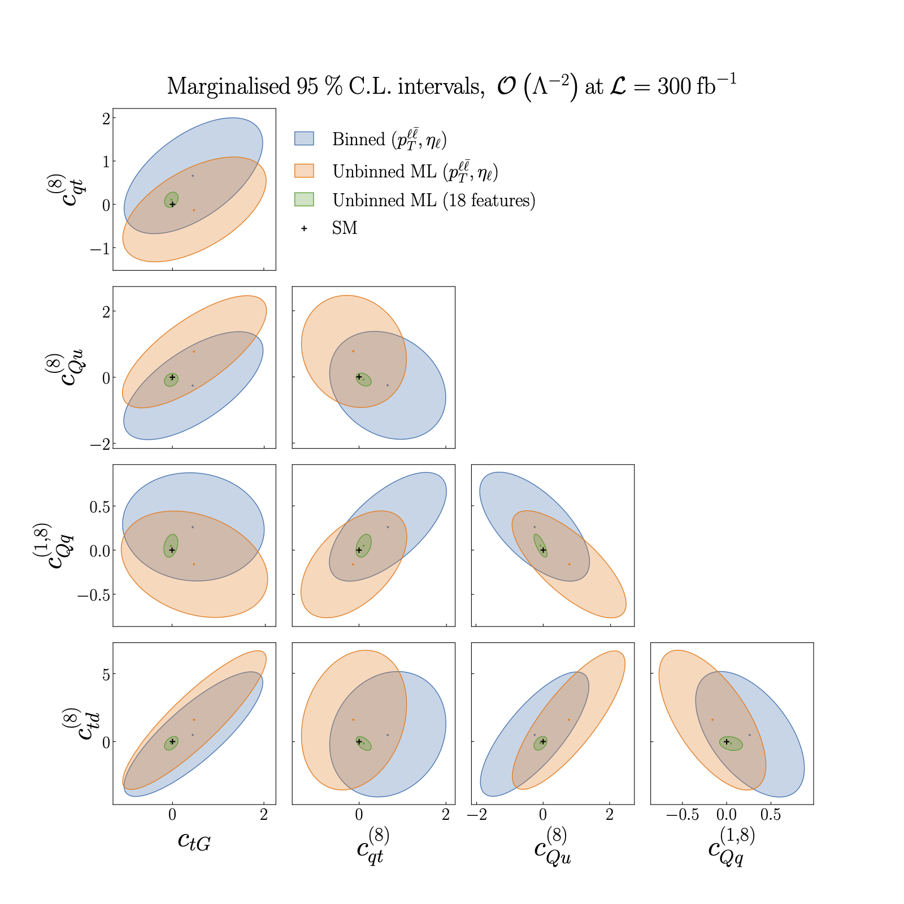

.. _particle3:

Results from the ML model trained on two features vs all features, :math:`O(\Lambda^{-2})`
======================================================================================
Figure 5.3 of :cite:`ML4EFT_temp_id`.

Following from :ref:`the previous results<particle2>`, we now present a comparison of the results obtained by
means of the ML model when only (:math:`p_{\ell \ell}`, :math:`\eta_{\ell}`) are used for the training vs when the full set of :math:`n_{k} = 18` kinematic features is
used.  We observe a marked improvement in the constraints obtained on each SMEFT operator when all kinematic features are used.

