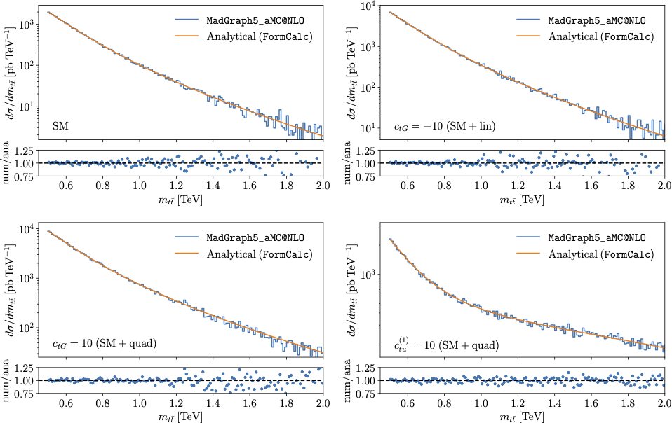
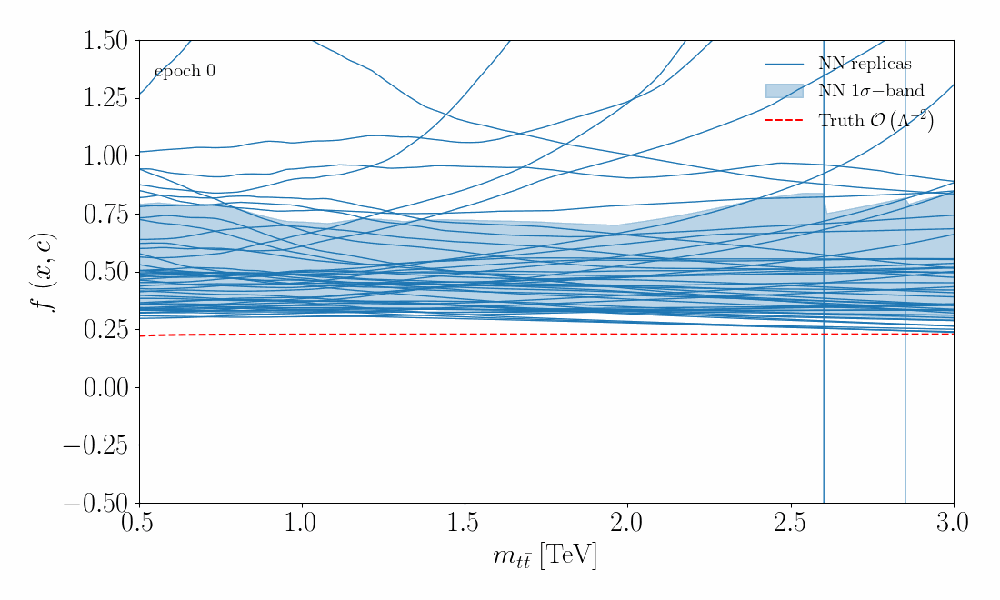
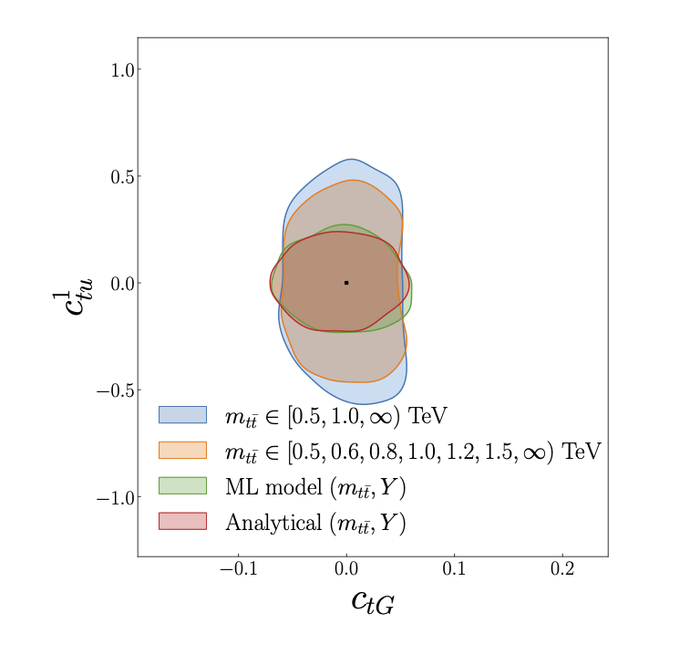

Parton level analysis of :math:`t\bar{t}` production
============================================================

We present here... add details of setup.  Reminder that this is a crucial step in benchmarking the code.

Pseudo-data generation and benchmarking
---------------------------------------

See also (link to truth predictions in code) for the specifics.

Neural network training
------------------------------
First, we present the details of the training of the neural network...

Show the linear part being trained:

Show the quadratic part being trained:

Comparison of truth with NN over time, 2D in mtt and Y.  Also show pull plots?

.. image:: ../images/anim_2d.gif
   :width: 48 %
.. image:: ../images/anim_2d.gif
   :width: 48 %

Constraints on SMEFT operators
-------------------------------
Secondly, we present the resulting constraints on the SMEFT operators
... and ....  Insert table with reminder of operator definitions.

