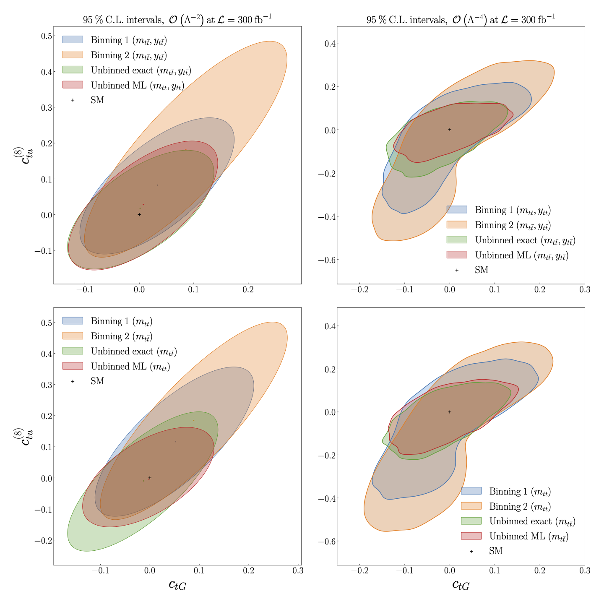

Constraints on the EFT
============================================================
For the purpose of this benchmark study, we present constraints
only on the Wilson coefficients of the operators :math:`\mathcal{O}_{tG}` and :math:`\mathcal{O}_{tu}^{(8)}` of the SMEFT :cite:`Aguilar-Saavedra:2018ksv`, :cite:`Grzadkowski:2010es`.

We compare the constraints at 95 % CL obtained from a binned analysis to those obtained from the unbinned ML model.
In the upper plots we make use of both the invariant mass :math:`m_{t \bar{t}}` and rapidity :math:`y_{t \bar{t}}` of the top quark pair,
whereas in the lower plots we obtain constraints from :math:`m_{t \bar{t}}` only.  The binnings are defined as follows:

- Binning 1: 

.. math::
   m_{t \bar{t}} \in [1.45, 1.5, 1.55, 1.6, 1.7, 1.8, 1.9, 2.0, 2.1,\\ 2.2, 2.3, 2.4, 2.5, 2.6, 2.7, 2.8, 2.9, 3.0, \infty) \textrm{ TeV}, \\
   y_{t \bar{t}} \in \pm [0, 0.3, 0.6, 0.9, 1.2, 3.0]

- Binning 2:

.. math::
   m_{t \bar{t}} \in [1.45, 2.5, \infty) \textrm{ TeV}, \\
   y_{t \bar{t}} \in \pm [0,1.5,3.0] 
  
We demonstrate the constraints obtained from a calculation at linear order :math:`O(\Lambda^{-2})` in the EFT calculation (left), and
at quadratic order :math:`O(\Lambda^{-4})` in the EFT calculation (right).  In both cases we find an improvement in the
constraints obtained using the unbinned ML model compared to the binned analysis, as well as good agreement 
between the ML model and exact calculation.

   

