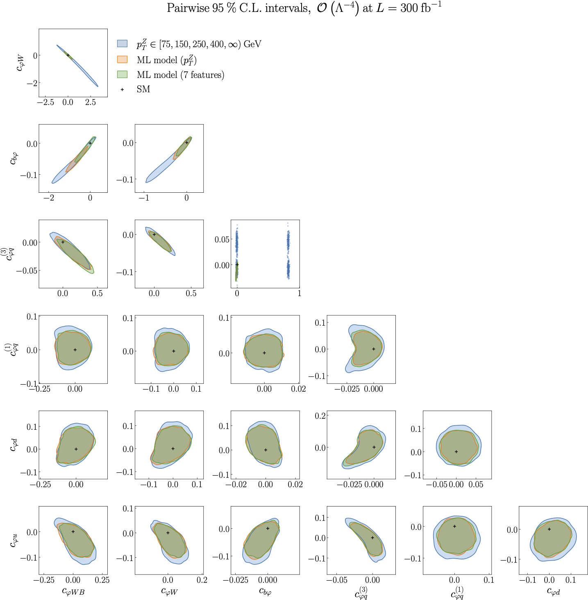

Results from the ML model vs binning in :math:`p_{T}^{Z}`, :math:`O(\Lambda^{-4})`
==================================================================================

Figure 5.7 of :cite:`ML4EFT_temp_id`.

The pair-wise 95% CL contour ellipses obtained from two-parameter fits in the case of :math:`p p \rightarrow h Z \rightarrow b \bar{b} \ell^{+} \ell^{-}` at the quadratic level in the EFT expansion,
where for each panel the contribution from the operators not shown is set to zero.

We compare the bounds obtained from a binned :math:`p_{T}^{Z}` distribution with those from two ML unbinned observables, first when only :math:`p_{T}^{Z}` is used for the training and second when :math:`n_{k} = 7` kinematic features are used to parametrise the likelihood ratio.

