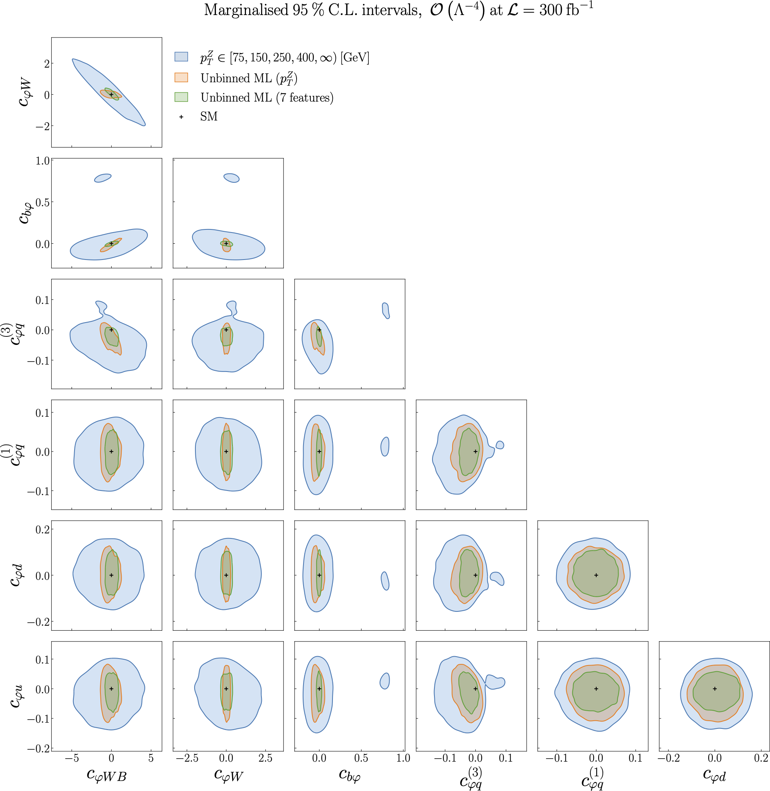

Results from the ML model vs binning in :math:`p_{T}^{Z}`, :math:`O(\Lambda^{-4})`, fully marginalised
=========================================================================================================

Figure 5.8 of :cite:`ML4EFT_temp_id`.

The 95% CL contour ellipses, this time
obtained from a marginalisation over the complete posterior distribution obtained from Nested Sampling
at the quadratic level in the EFT expansion.

We compare the bounds obtained from a binned :math:`p_{T}^{Z}` distribution with those from two ML unbinned observables, first when only :math:`p_{T}^{Z}` is used for the training and second when :math:`n_{k} = 7` kinematic features are used to parametrise the likelihood ratio.

We observe a marked improvement in the constraints obtained on each SMEFT operator when the ML model is used, particularly 
when all kinematic features are used.

